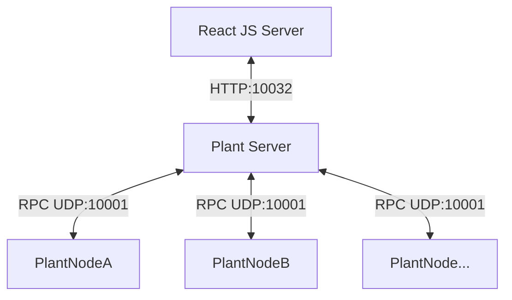

# Project Title

Plant node server backend run on any Linux host:
- plant node discovery
- plant node communication
- React JS server communication



## Development
### Getting Started

Get the project
```properties
> git clone git@github.com:QN-GZ/server-plant.git
> cd server-plant
> npm run install
```
### Plant nodes RPC
Plant server communication to plant node via UDP socket on port 10001:
- `Plant.Discovery` - A UDP broad cast discovery message to all devices on the network
discovery response:
```json5
{
  id: 'myplant-782184F89DF0',
  app: 'my-plant-node',
  fw_version: '1.0',
  fw_id: '20231231-061644/2.13.0-ge44f822-dirty',
  mg_version: '202312302350',
  mg_id: '20231230-235004',
  mac: '782184F89DF0',
  arch: 'esp32',
  uptime: 1168,
  public_key: null,
  ram_size: 288416,
  ram_free: 229332,
  ram_min_free: 224020,
  fs_size: 5177344,
  fs_free: 5132288,
  dryness_pct: 0,
  dryness: BASE_DRYNESS,
  max_dryness: PLANT_MAX_DRYNESS,
  wifi: {
    sta_ip: '192.168.86.207',
    ap_ip: '',
    status: 'got ip',
    ssid: 'FamilyGuest'
  }
}
```
- `Plant.Get`
```json5
{
  "src": "plant A",
  "result": {
    "dryness": 0,
    "max_dryness": 1000,
  }
}
```
### React JS server HTTP
1. `/plant`
  - GET response
```json5
[
{ ... },
{
  id: 'myplant-782184F89DF0',
  app: 'my-plant-node',
  fw_version: '1.0',
  fw_id: '20231231-061644/2.13.0-ge44f822-dirty',
  mg_version: '202312302350',
  mg_id: '20231230-235004',
  mac: '782184F89DF0',
  arch: 'esp32',
  uptime: 1168,
  public_key: null,
  ram_size: 288416,
  ram_free: 229332,
  ram_min_free: 224020,
  fs_size: 5177344,
  fs_free: 5132288,
  dryness_pct: 0,
  dryness: BASE_DRYNESS,
  max_dryness: PLANT_MAX_DRYNESS,
  wifi: {
    sta_ip: '192.168.86.207',
    ap_ip: '',
    status: 'got ip',
    ssid: 'FamilyGuest'
  },
  dryness: 0,
  max_dryness: 1000,
},
{ ... }
]
```
## Testing
Start the server manually
```properties
> npm run main
```

## Deploy and register server as a system service starting with the OS on a Linux Host
1. Place the systemd service file in the correct directory: systemd service files are usually placed in `/etc/systemd/system/`
```properties
> sudo cp /path/to/your/plant_server.service /etc/systemd/system/plant_server.service
```
2. Reload systemd to recognize the new service: After copying the file, you need to tell systemd to reload its configuration so it recognizes your new service.
```properties
> sudo systemctl daemon-reload
```
3. Enable the service to start on boot: To ensure your service starts automatically when the OS boots, you need to enable it using the systemctl command.
```properties
> sudo systemctl enable plant_server.service
```
4. Start the service immediately (optional): If you want to start the service immediately without rebooting, you can use:

```properties
> sudo systemctl start plant_server.service
```

## Debugging
The `plant_server.service` execute 2 programs in detached screen sessions. We can reattach the screen sessions to observe activities logs.

1. To find screen session:
```properties
$ sudo screen -ls

There are screens on:
	749..plantio	(03/01/25 20:10:34)	(Detached)
	753..plantio	(03/01/25 20:10:34)	(Detached)
2 Sockets in /run/screen/S-root.
```

2. To reattach to a `screen` session from the list:
```properties
$ screen -r <session id>
eg: screen -r 749
```

3. To detach a `screen` session without terminating:
```properties
$ ctlr + a,d
```

